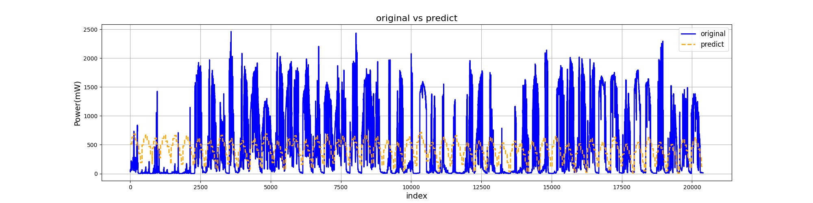
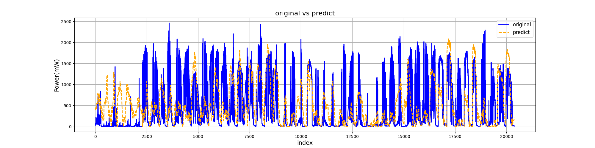
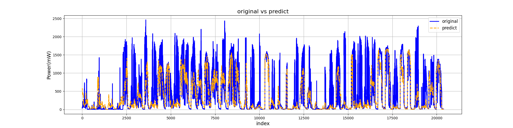

# predict_power
CYUT Machine Learning Class Final Report for AI CUP 2024 Fall 根據區域微氣候資料預測發電量競賽
## 簡介
使用 Linear Regression 、LightGBM及Multi-layer Perceptron Regressor來預測太陽能發電量，由於AICUP官方還沒有給最後解答，所以本篇以資料集內每個月的三十日的早上九點到下午三點來當作預測的目標並比較這三種模型所預測出的結果跟實際結果。
## Runtime Environment
- Python Version: 3.11.0
- NumPy: 1.26.4
- Pandas: 2.2.3
- Scikit-learn: 1.5.2
- Joblib: 1.4.2
- Matplotlib: 3.9.2
- LightGBM: 4.5.0
## Dataset

### 1. 資料來源
- **官方資料集**：來自 AICUP 官網的 L1~L17_Train.csv 以及 L2,4,7,8,9,10,12_Train_2.csv。

### 2. 資料集
- **訓練資料**：`ML_finalReport_train.csv`，用於模型訓練。
- **測試資料**：`ML_finalReport_test.csv`，用於模型預測。

### 3. 特徵 (處理前)
以下為原始資料集中的特徵：
- `LocationCode`：位置代碼
- `DateTime`：日期與時間
- `WindSpeed(m/s)`：風速
- `Pressure(hpa)`：氣壓
- `Temperature(°C)`：氣溫
- `Humidity(%)`：濕度
- `Sunlight(Lux)`：光照強度
- `Power(mW)`：發電量

### 4. 特徵 (處理後)
處理後的資料集包含以下特徵：
- `LocationCode`：位置代碼
- `DateTime`：日期與時間
- `WindSpeed(m/s)`：風速
- `Pressure(hpa)`：氣壓
- `Temperature(°C)`：氣溫
- `Humidity(%)`：濕度
- `Sunlight(Lux)`：光照強度
- `Power(mW)`：發電量
- `year`：年份
- `month`：月份
- `day`：日期
- `hour`：小時
- `minute`：分鐘
- `weekday`：星期幾
- `hour_sin`：小時的正弦週期性特徵
- `hour_cos`：小時的餘弦週期性特徵
- `minute_sin`：分鐘的正弦週期性特徵
- `minute_cos`：分鐘的餘弦週期性特徵
- `month_sin`：月份的正弦週期性特徵
- `month_cos`：月份的餘弦週期性特徵
- `quarter`：季度
- `day_of_year`：年度中的第幾天
- `week_of_year`：年度中的第幾周
- `hour_squared`：小時的平方
- `time_of_day`：一天中的時間段（如早上、下午等）

### 5. 資料筆數及維度
- **處理前**：1375028 筆資料，8 個特徵
- **處理後**：
  - 訓練集：1335199 筆資料，25 個特徵
  - 測試集：20393 筆資料，25 個特徵

### 6. 腳本
- **資料處理腳本**：`ML_finalReport_traindata.py`

### 7. 資料處理步驟
1. **剔除不合理的數據**：
   - 處理缺失值與異常值。
2. **拆分 `DateTime`**：
   - 將 `DateTime` 轉換為 `year`、`month`、`day`、`hour`、`minute`、`weekday`。
3. **計算時間週期性特徵**：
   - 根據拆分的時間特徵，計算：`hour_sin`、`hour_cos`、`minute_sin`、`minute_cos`、`month_sin`、`month_cos`。
4. **增加其他時間週期性特徵**：
   - 計算：`quarter`、`day_of_year`、`week_of_year`、`hour_squared`、`time_of_day`。
5. **資料劃分**：
   - 將每月 30 日的 9 點至 15 點的數據存入 `test.csv`，其他數據存入 `train.csv` 進行訓練。

## Train

### 1. **Linear Regression**
   - **腳本**: `ML_finalReport_linear.py`
   - **結果**：
   
   
   
### 2. **LightGBM**
   - **腳本**: `ML_finalReport_lightgbm.py`
   - **結果**：
   
   
   
### 3. **Multi-layer Perceptron Regressor**
   - **腳本**: `ML_finalReport_mlp.py`
   - **結果**：
   
   
   
### 4. **LightGBM Stacking**
   - **腳本**: `ML_finalReport_lightgbm_stack.py`
   - **結果**：
   
   

## 結論
  - 四個模型比較

      | 指標 | linear  | LightGBM  | MLP  | stacking  |
      |:--------------------:|:---------------:|:---------------:|:---------------:|:---------------:|
      | 均方誤差 (MSE) | 151088.971 | 22723.869  | 52031.444 | 17736.343 |
      | 平均絕對值誤差 (MAE) | 256.771 | 67.911 | 131.756 | 51.626 |
      | R² 分數 | 0.244  | 0.886 | 0.739 | 0.911 |
      | 均方根誤差 (RMSE) | 388.701 | 150.744 | 228.104 | 133.177 |
      | 總發電量(9842244mW) | 總誤差(9280692mW) | 總誤差(5967945mW) | 總誤差(8951724mW) | 總誤差(5913228mW) |
  
  - LightGBM_stacking的結果最好，以此方法實際去比賽AICUP秋季賽根據區域微氣候資料預測發電量競賽。
    - Private Leaderboard 22 名。
    - Private Leaderboard 成績(總誤差)619536.9。
    - 我們AICUP的程式連結 : https://github.com/zxcvb8885123/al-cup
